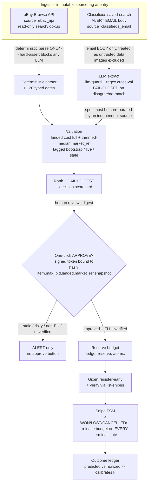

# Quartermaster -- Architecture + Data Flow

Distilled from `plan-final.md` (authoritative) into the system blueprint AND the
eBay-application artifact ("data flows of your user experience"). No design decisions
are introduced here that contradict `plan-final.md`; this makes it concrete. Any change
that alters the plan goes in `DECISIONS.md`.

## 1. System in one paragraph

A single-user agent that turns two listing sources (the eBay Browse API and EU
classifieds saved-search alert emails) into a ranked daily digest of value-for-fit RAM,
and lets the human **one-click approve** a Gixen auction snipe within a hard budget.
The value is the funnel *before* the click (compatibility gating + live landed-cost
valuation + budget discipline); execution is delegated to Gixen. Nothing bids
autonomously on eBay.

## 2. Data flow (the keystone)

**LLM output never touches price, budget, or seller-facing text.** It only assists
extraction on the classifieds-email path.

## 3. Trust boundaries (hard-coded, test-enforced)

- **B1 -- eBay-content / LLM separation.** eBay API content is `source=ebay_api`-tagged
  at ingest and processed deterministically only; a hard assert + a golden-set test
  refuse any `ebay_api` record reaching an LLM component. Raw eBay content is purged
  < 6 h, never logged, never recorded to cassettes.
- **B2 -- inbound-untrusted vs approval out-of-band.** Inbound alerts (classifieds
  emails) are attacker-influenceable, so the **approval channel is distinct and
  out-of-band** from the inbound channel. Classifieds text is wrapped as data; operator
  instructions live only in the `system` prompt; `llm-guard` + regex cross-validation
  fail closed.
- **B3 -- money/execution.** Real money requires **two independent signals**
  (`DRY_RUN=false` AND a separately-stored signed arm token). The Gixen host is a
  compiled constant, not config. EU-only auto-bid; non-EU -> ALERT.

## 4. Module map (v1 OSS stack, per plan sec. 6)

| Block | Module(s) | Stack | Tier |
|---|---|---|---|
| Ingest-eBay | `ingest/ebay_client.py` | httpx + OAuth + tenacity + pyrate-limiter | A (source-tag) |
| Ingest-classifieds | `ingest/email_source.py` | Gmail MCP (read one label) | A (parser) |
| Extract | `extract/` | Claude structured outputs + llm-guard + regex cross-val | A (parser) |
| Verify | `verify/gates.py` | ~20 plain typed predicates; unknown -> unverified | A |
| Value | `value/` | numpy + scipy.stats trimmed-median + CurrencyConverter + bootstrap table | A (money math) |
| Bid+budget | `bid/`, `ledger/` | httpx->Gixen; SQL reserved-ledger + release; python-statemachine | A |
| Orchestrate | `app/`, `config.py` | APScheduler 3 + SQLAlchemy 2 + Alembic; pydantic-settings + keyring | B |
| Digest/UX | `digest/` | rendered digest + decision scorecard | B |
| Tests/CI/Obs | `tests/`, CI | pytest+respx+vcrpy + egress-blocker; structlog; healthchecks.io | A on money paths |

## 5. Snipe FSM

`PENDING -> REGISTERED -> VERIFIED -> FIRED -> WON -> PAID -> SHIPPED -> RECEIVED ->
TESTED -> KEPT | RETURNED`, plus `ERROR / EXPIRED / CANCELLED / NEEDS_HUMAN_RECONCILE`.
Timeout edges from every non-terminal state via a reaper (releases budget). T-lead
re-verify can cancel/reduce a snipe (Gixen delete), not only confirm. A FIRED row past
close with no outcome -> `NEEDS_HUMAN_RECONCILE` (page human, do NOT release budget).

## 6. Reserved-budget ledger (the CRIT invariant)

- Reserve: atomic `UPDATE budget SET committed=committed+:max WHERE committed+:max<=cap`.
- Release: **every transition OUT of an active state** runs `committed=committed-:max`
  in the SAME transaction.
- Reconciler: periodically recomputes `committed = Sum(max_bid) over active rows`,
  corrects drift, alerts when `committed/cap` is high (leak detector).
- Invariant (property-tested): committed never exceeds cap; no terminal state leaks
  budget; `committed == Sum(active max_bid)` always.

## 7. Idempotency, persistence, time

- `UNIQUE(account, ebay_item_id, snapshot_hash)`; write-ahead PENDING row before the
  Gixen call; content-fingerprint dedup for relists; startup reconciliation vs Gixen.
- SQLite WAL + busy_timeout + single-writer; Alembic (CI runs upgrade->downgrade->
  upgrade); scheduled backups + a tested restore+reconcile drill before arming v2.
- tz-aware UTC everywhere; zero-discovery treated as suspect; healthchecks.io dead-man.

## 8. What v0 builds (foundation only)

The schema (ledger+FSM+source-tag), config/keyring, structlog redaction, CI, the
network-egress test-blocker, healthchecks ping, DECISIONS.md. **No bidding logic, no
LLM, no eBay calls, no SPD part-number DB.** eBay leg sits behind a feature flag until
Gate 0 (production Browse API access) is resolved.
